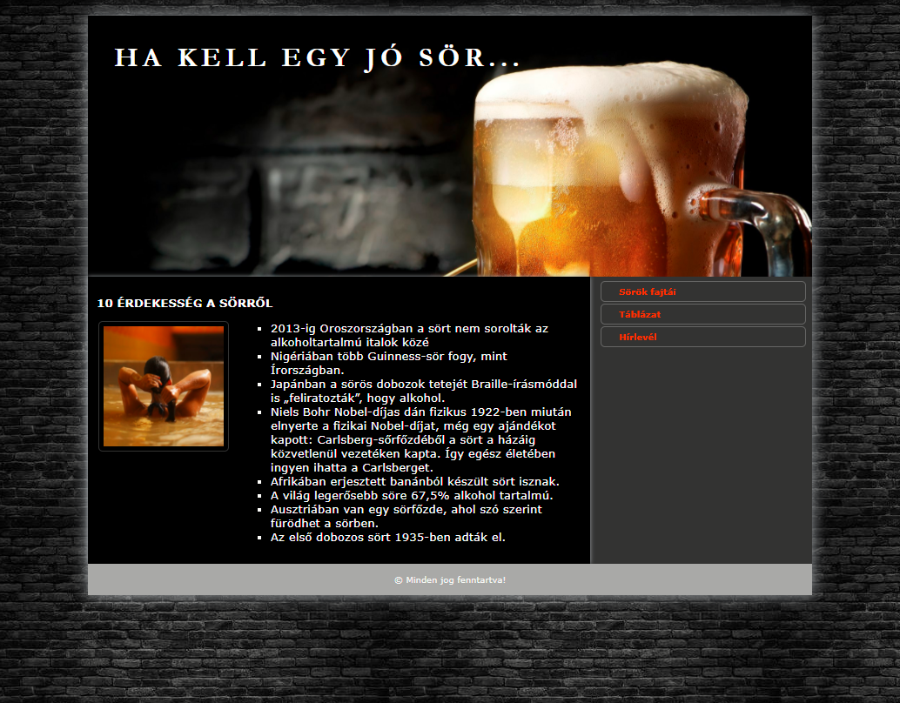
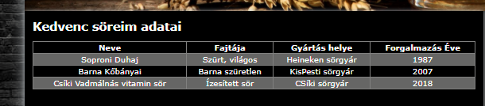

# Sör

[view page](https://zschopper.github.io/ikt_projektmunka_1-agazati_proba-sor/)  

## Elkészítendő a mintán szereplő weboldal

1. A projekt neve SAJATNEV_SOR legyen  
2. Hozd létre a minta alapján az index.html állományt  
3. Hozd létre a stilus.css állományt és csatold az index.html-hez.  
4. Helyezd el benne a szokásos meta tag-eket!  
5. Alakítsd ki az oldal szerkezetét html5 szemantikus elemekkel.  
6. Állítsd be a html nyelvét magyarra.  
7. Készíts másolatot az oldalról tablazat.html néven, és készítsd el a táblázatot is.  

## A stílus css-ben

1. Minden elem box-sizing méretét állítsd be border-box-ra!  
2. A betűcsalád legyen Arial, Verdana, sans-serif!  
3. A betűszín beige, a betűméret 10pt, a külső és a belső margó 0px.  
4. A háttérkép legyen a minta szerint.  

5. Alakítsd ki a rácsszerkezetet a mintának megfelelően!  

6. A main elem szélességét állítsd 80%-ra.  
7. A main elem ne lehessen nagyobb, mint 1000px.  
8. Állítsd a teljes tartalmat a böngésző közepére!  
9. A main elem háttérszíne legyen RGB kóddal megadva: #333333  

10. A header elembe állíts be a háttérképet!  
11. A header magassága legyen 300px;  
12. A háttér méretezését állítsd cover-re: background-size:cover;  
13. A fejlécben lévő szöveg legyen vastag betűs!  
14. A fejlécben lévő szöveg betű típusa legyen Garamond.  
15. A betűk közti távolság 4px, a betűméret 32px, legyen balra igazítva, és felső és a bal oldali belső margó 30px.  

16. Készítsd el a navigációt a mintának megfelelően.  
17. A navigáció li elemei előtt ne legyen felsorolásjel!  
18. A li elemeket vegye körbe 1 px vastag folytonos fehér vonal, sarkai legyenek lekerekítettek.  
19. Ha a navigáció li eleme fölé viszem az egeret, a háttérszín változzon világos színűre!  
20. A navigáció linkjeiről szedd le az aláhúzást!  
21. A navigáció linkjeinek betűszíne legyen  piros, ha föléjük viszem az egeret változzanak fehérre.  
22. A navigáció linkjei legyenek vastag betűsek.  
23. Az article elemen belül a bekezdések legyenek sorkizárt igazításúak.  
24. Az article elemben a bekezdések betű mérete legyen 10px!  
25. Az article elemben a cím betű mérete legyen 15px!  
26. Az article elemen belül a kép ússzon el a szöveg mellé balra.  
27. A felsorolások előtti jel legyen square (négyzet).  
28. Az oldal legyen reszponzív! 700 px alatt a main közvetlen gyerekelemei egymás alatt helyezkedjenek el.  
29. A táblázat szegélyezését készítsd el a minta szerint.  
30. Minden második sora legyen világosszürke színű : tr:nth-child(odd) {}  

31. Validáld az oldalt!  
32. Tömörítsd a teljes projektet ZIP-be, és töltsd fel az etananyagra!  
33. Töltsd fel a public_hmtl mappa tartalmát az FTP tárhelyre és a linket oszd meg az etananyagon.  
